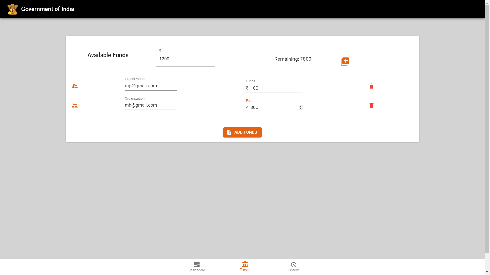
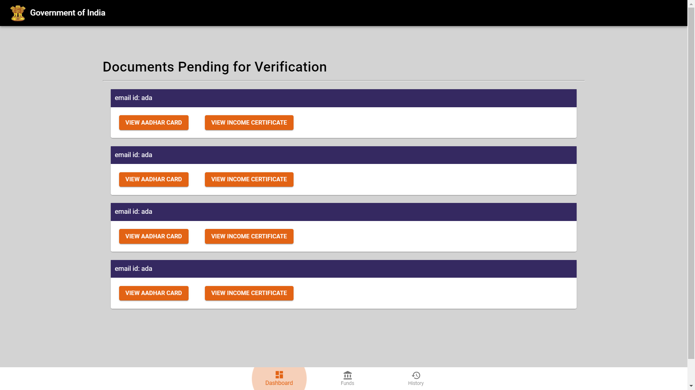



# CodeShastra 6.0
Repository for CodeShastra 6.0, 2020 by Team Vortex, finishing as 1st Runner's Up in the hackathon.

# Problem Statement

> ## Corruption is the true enemy to development

# Table of Contents

* [Description](https://github.com/amurto/beegchan#description)
* [Dependencies](https://github.com/amurto/beegchan#dependencies)
* [Installation](https://github.com/amurto/beegchan#installation)
  * [Prerequisites](https://github.com/amurto/beegchan#prerequisites)
  * [Instructions](https://github.com/amurto/beegchan#instructions)
* [Usage](https://github.com/amurto/beegchan#usage)
* [Contributors](https://github.com/amurto/beegchan#contributors)
* [License](https://github.com/amurto/beegchan#license)

# Description

Corruption or frauds have become common terms which are associated with government bodies working across the globe. It often leads to several social and economic problems, if remain unchecked. Increase in the rate of corruptionadversely affects the development of any country. The government funds or money which is intended for the welfare of the public goes in the pocket of greedy officers. Thus, development of generic scenario is necessary in which a government has various schemes running for the welfare of common people and the funds are disbursed through a layered architecture of government passing through various organizations. Non transparency, poor management of government records, delay in verification process can lead to corruption in various schemes at various levels. Also, it is very important to verify the identities of the people's and the proofs submitted by them are true and marks up the eligibility criteria to claim the benefits of the welfare scheme disbursed by the government. But identity verification is a serious problem. A digital identity reduces the level of bureaucracy and increases the speed of processes within organizations. But if this digital identity is stored on a centralized server, it becomes a honeypot for hackers. So, there's a need for a mechanism that detects multiple frauds that take place by providing false identity, false documents to claim the advantage of this funds.

The project aims to ensure proper verification of documents and fund disbursement without any leaks. 

We have implemented the following features as a part of this process:
* BigchainDB, a database with blockchain characteristics, is used to to provide transparency, efficient management of government records and fast verification process.
* User authentication is done using Vault which provides secure, store and tightly control access to tokens, passwords, certificates, encryption keys for protecting secrets and other sensitive data.
* This provides an efficient and reliable identity management system for verification to the government for authorized public to claim these funds and enjoy the benefits of the same using Blockchain Technology.
* A React dashboard for both the government and citizens for verification and management as well as disbursement of funds.
 
# Dependencies

* [BigchainDB](https://www.bigchaindb.com/)
* [Vault](https://www.hashicorp.com/products/vault/)
* [Node.js](https://nodejs.org/en/)
* [npm](https://www.npmjs.com/)
* [React.js](https://reactjs.org/)

# Installation

### Prerequisites

Install Node.js and npm using the link above. Follow instructions on their respecive websites. Npm is included with Node.js

Install Vault with the link above, following instructions on their respecive websites.

### Instructions

Clone the repository
```bash
git clone https://github.com/amurto/beegchan.git
```

Install all the dependencies in backend
```bash
cd government 
npm install
```

Install all the dependencies in government
```bash
cd government 
npm install
```

Install all the dependencies in client
```bash
cd client 
npm install
```

# Usage

Run the project
```bash
cd backend
npm run serve
```

```bash
cd government
npm start
```

```bash
cd client
npm start
```

Open a web browser and go to
```bash
http://localhost:3000
```

### Landing Screen for citizens


### Government Funds Screen


### Verification Dashboard



# Contributors

* Pratik Chowdhury [@pratikpc](https://github.com/pratikpc)
* Elvis Dsouza [@ejson03](https://github.com/ejson03)
* Amurto Basu [@amurto](https://github.com/amurto)
* Princeton Baretto [@princebaretto99](https://github.com/princebaretto99)

# License

[](https://opensource.org/licenses/MIT)

[MIT License Link](https://github.com/amurto/beegchan/blob/master/LICENSE)
